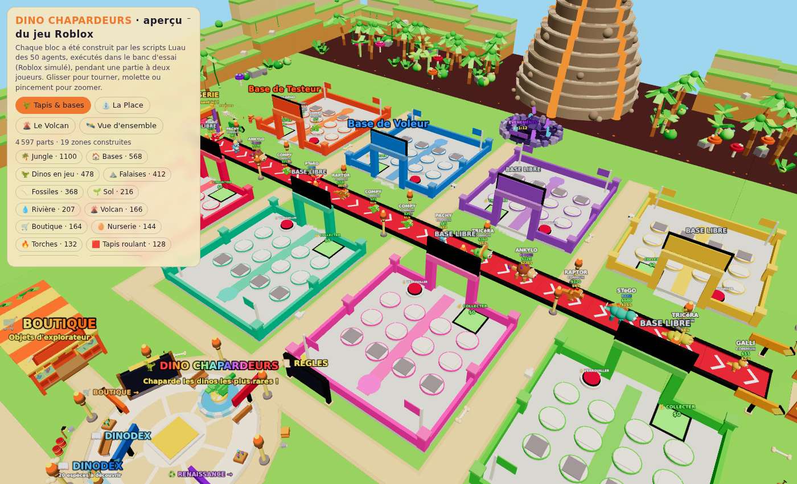
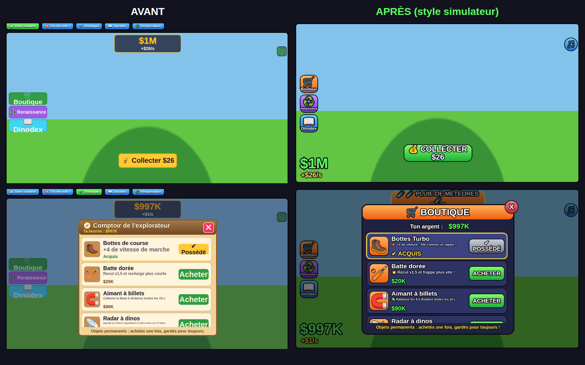

# 🦖 Dino Chapardeurs — le jeu Roblox codé par les 50 agents

Un jeu Roblox complet du genre « vole un dino », écrit en Luau par les 50
experts IA du studio Atelier Roblox : chacun a codé **un module** en respectant
un contrat commun ([`CONTRAT.md`](CONTRAT.md)). Tout le monde est construit par
script au lancement : aucun modèle à importer.




## 🎨 Style « simulateur Roblox »

Le jeu a le look des grands simulateurs Roblox du genre « Steal a … » (textes
blancs cernés de noir, gros boutons cartoon en dégradé, étiquettes géantes
au-dessus des dinos et des bases, argent vert, revenus jaunes, raretés en
dégradé — arc-en-ciel animé pour les Divins). La direction artistique est dans
[`STYLE.md`](STYLE.md) et la boîte à outils partagée dans
`ReplicatedStorage/Dino/Style.lua`. Pour voir l'interface sans Roblox :
**`Apercu-Interface.html`** (HUD, boutique, Dinodex, renaissance, alerte de vol,
redessinés d'après ce que les scripts créent réellement).

## ▶️ Jouer dans Roblox Studio

1. Ouvrez **`DinoChapardeurs.rbxlx`** dans Roblox Studio (Fichier ▸ Ouvrir).
2. Pour tester à plusieurs (indispensable pour le vol) : onglet **Test ▸
   Clients et serveurs ▸ 2 joueurs ▸ Démarrer**. Sinon, **Jouer** (F5).
3. Pour publier : Fichier ▸ Publier sur Roblox, puis activez **« Autoriser
   l'accès Studio aux services API »** dans les paramètres du jeu pour que la
   sauvegarde fonctionne aussi en test.

En mode édition la place paraît vide : tout est généré au démarrage par
`ServerScriptService.Dino.Demarrage`. Avec Rojo : `rojo serve` dans ce dossier.

## 🎮 Le jeu

- **Ta Base** : chaque joueur reçoit l'une des 8 bases colorées de part et
  d'autre du grand **Tapis rouge**.
- **Acheter** : les dinos sortent de la Nurserie et défilent sur le Tapis.
  Achète-les (E) : ils marchent jusqu'à ta base et y gagnent de l'argent chaque
  seconde. Marche sur la dalle 💰 pour encaisser.
- **Voler** : entre dans la base d'un autre joueur, maintiens E sur un de ses
  dinos et rapporte-le chez toi ! Pendant ce temps tu es plus lent…
- **Se défendre** : verrouille ta base 🔒 60 s avec le bouton près de
  l'entrée. Frappe les voleurs avec ta **batte** 🏏 (clic ou F) : ils lâchent
  leur butin, qui rentre chez toi.
- **20 espèces sur 7 raretés** (Commun, Rare, Épique, Légendaire, Mythique,
  Divin, Secret) et des **mutations** (Or, Diamant, Arc-en-ciel, Lave, Météore)
  qui multiplient le prix et le revenu.
- **Événements** : pluie de météores, éruption du volcan, lune dorée — plus
  de raretés et des mutations exclusives.
- **Renaissance** ♻️ à l'Autel : on repart de zéro avec un multiplicateur de
  revenus et un emplacement de plus.
- **Boutique** (bottes de course, batte dorée, aimant à billets, radar à
  dinos), **Dinodex** (bonus quand une rareté est complète), récompenses de
  connexion et de temps de jeu, **coffre caché** en haut des falaises.

Commandes de test (Studio uniquement, dans le chat) : `/argent N`,
`/dino Espece [Mutation]`, `/evenement Nom`, `/renaissance`, `/vider`, `/aide`.

## 🧩 Qui a codé quoi

| Dossier | Modules |
|---|---|
| `ReplicatedStorage/Dino` | Charte, Plan, Outils, Equilibrage (tous les chiffres, réglés par l'équilibreur), Reseau, Bus |
| `ServerScriptService/Dino/Builders` (19) | DinosHerbivores, DinosCarnivores, Ciel, Sol, Falaises, Jungle, Riviere, Volcan, Tapis, Nurserie, FinTapis, Bases, Place, Comptoir, Autel, Cratere, Fossiles, Lumieres, Signaletique |
| `ServerScriptService/Dino/Systemes` (18) | Donnees, Economie, Bases, Tapis, Enclos, Achat, Vol, Batte, Renaissance, Boutique, Index, Evenements, Classement, Recompenses, Securite, GardeFou, Autotest, ModeTest |
| `StarterPlayerScripts/Dino/Interface` (13) | HUD, Base, Vol, Batte, Boutique, Renaissance, Index, Mobile, Effets, AnimationsDecor, Sons, Musique, Tutoriel |

## 🧪 Banc d'essai

`outils/banc/` exécute réellement tous les scripts dans un Roblox simulé, avec
**deux joueurs** (un voleur et sa victime) : construction du monde, arrivée,
achats, collecte, vol réussi, vol raté à coups de batte, base verrouillée,
boutique, vente, événement, panneaux, renaissance, départ et sauvegarde —
42 contrôles.

```bash
cd outils/banc && npm install && node banc.js
```

`node outils/rbxlx.js` régénère la place ; `node outils/apercu-interface.js` régénère l'aperçu de l'interface ; `node outils/apercu.js` régénère
**`Apercu-3D.html`** (le monde tel que les scripts l'ont construit, visible
dans un navigateur, hors ligne).

## ⚠️ Limites connues

- Le banc simule l'API Roblox : il attrape les erreurs d'exécution et les
  incohérences entre modules, pas le rendu exact ni la physique (recul de la
  batte, collisions).
- **Musique** : aucune piste fournie (droits d'auteur) ; ajoutez vos ids dans
  `Interface/Musique.lua`. **Sons** : sons intégrés à Roblox uniquement.
- Jeu original inspiré du genre « Steal a … » : nom, dinos, décors et textes
  sont propres à ce projet.
