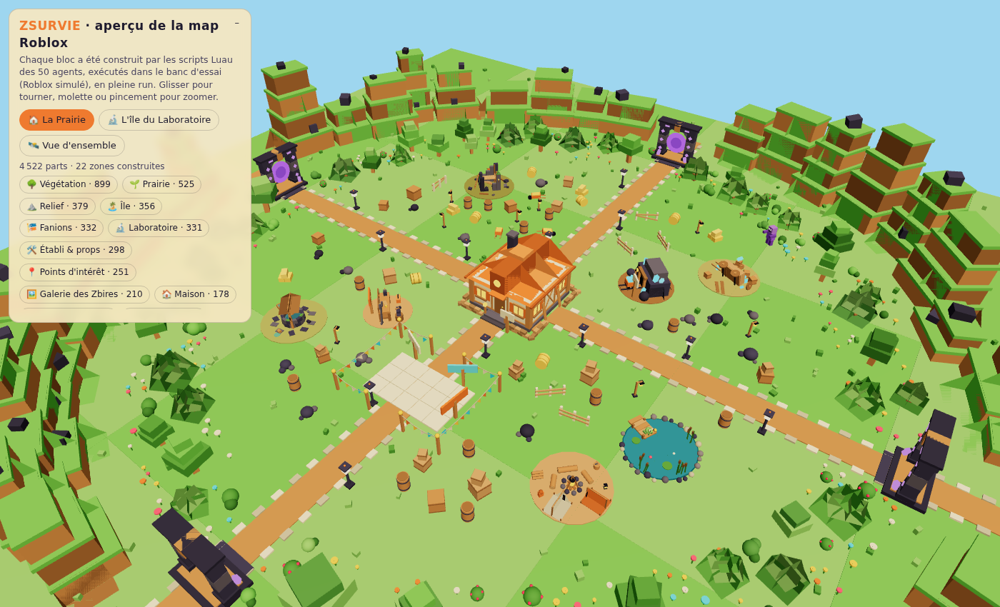
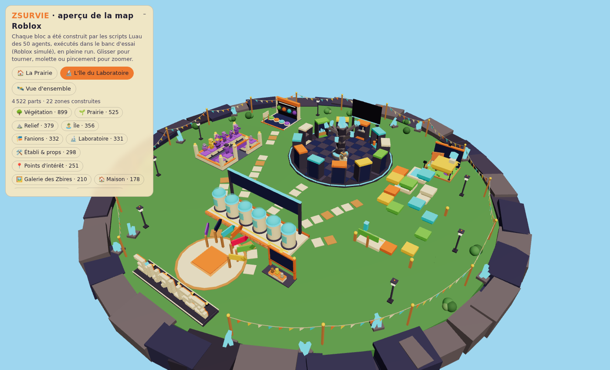

# 🧟 Zsurvie — la map Roblox codée par les 50 agents

Une vraie map Roblox jouable, écrite en Luau par les 50 experts IA du studio
Atelier Roblox : chacun a codé **un module** (décor, système de jeu ou
interface) en respectant un contrat commun ([`CONTRAT.md`](CONTRAT.md)).
La map entière est **construite par script** au lancement : aucun modèle à
importer.

## ▶️ Jouer dans Roblox Studio

1. Ouvrez **`Zsurvie.rbxlx`** dans Roblox Studio (Fichier ▸ Ouvrir).
2. Appuyez sur **Jouer** (F5). La map se construit en une fraction de seconde
   et vous apparaissez sur l'île du Laboratoire.
3. Pour publier : Fichier ▸ Publier sur Roblox, puis dans les paramètres du
   jeu activez **« Autoriser l'accès Studio aux services API »** pour que la
   sauvegarde (DataStore) fonctionne aussi en test.

En mode édition, la place paraît vide : c'est normal, tout est généré au
démarrage par `ServerScriptService.Zsurvie.Demarrage`.

Vous préférez Rojo ? `rojo serve` dans ce dossier (`default.project.json`).




## 🎮 La boucle de jeu

- **L'île du Laboratoire (lobby)** : Arbre des Recherches (dépensez vos 💎 en
  améliorations permanentes), Galerie des Zbires, parcours d'obstacles et
  énigme (récompenses en gemmes), tableau des records, monument, Doc Boulon.
- **Le Quai des Capsules** : montez dans une capsule, 5 s plus tard toute
  l'équipe (jusqu'à 6) atterrit sur la Prairie.
- **La Prairie** : les Zbires arrivent des 4 portails, par jours de plus en
  plus durs (10 types, Colosse tous les 5 jours). Cliquez pour tirer,
  approchez-vous de la Maison et appuyez sur **R** pour la réparer, ouvrez
  l'**Établi** pour les améliorations de run (pièces 🪙). La **Mine** produit
  des gemmes pendant la run.
- **Défaite** : quand la Maison tombe, gemmes de fin de run et retour au
  Laboratoire. Les gemmes et les recherches sont sauvegardées.

Commandes de test (dans Studio uniquement, via le chat) : `/gemmes 100`,
`/pieces 500`, `/soin`, `/tuer`, `/defaite`, `/aide`.

## 🧩 Qui a codé quoi

| Dossier | Modules |
|---|---|
| `ReplicatedStorage/Zsurvie` | Charte (couleurs), Plan (coordonnées), Outils, Equilibrage (tous les chiffres), Reseau, Bus |
| `ServerScriptService/Zsurvie/Builders` (23) | Zbires, Ciel, IleLabo, Prairie, Relief, Vegetation, Eau, Maison, Mine, Props, PointsInteret, Portails, Lumieres, Signaletique, Fanions, Laboratoire, QuaiCapsules, Galerie, Parcours, Enigme, Records, Monument, ScenePhoto |
| `ServerScriptService/Zsurvie/Systemes` (16) | Donnees, Economie, Classement, Etabli, Laboratoire, Blaster, Horde, Jour, TourelleToit, Securite, GardeFou, Boutique, Analytique, Performance, Autotest, ModeTest |
| `StarterPlayerScripts/Zsurvie/Interface` (10) | HUD, Blaster, Etabli, Recherches, Mobile, Effets, AnimationsDecor, Sons, Musique, Tutoriel |

Les modules ne se connaissent pas : ils communiquent par un bus d'événements
(`JourDebut`, `ZbireVaincu`, `DegatsMaison`…), des RemoteEvents et des
attributs. Si l'un plante, les autres continuent et l'erreur s'affiche dans la
sortie de Studio.

## 🧪 Banc d'essai

`outils/banc/` contient un **Roblox simulé** (Lua 5.3 via fengari) qui
exécute réellement tous les scripts : construction de la map, arrivée d'un
joueur, départ en capsule, 2 minutes de combat avec de vrais clics, achats à
l'Établi, réparation, défaite, recherche au Laboratoire, puis deuxième run
avec la tourelle. 30 contrôles, un rapport par fichier.

```bash
cd outils/banc && npm install && node banc.js
```

- `node outils/rbxlx.js` régénère `Zsurvie.rbxlx` à partir de `src/`.
- `node outils/apercu.js` régénère **`Apercu-3D.html`** : la map exactement
  telle que les scripts l'ont construite pendant une run, visible dans un
  navigateur (three.js intégré, fonctionne hors ligne). Il faut
  `npm install` dans `outils/banc` au préalable (three.js y est inclus).

## ⚠️ Limites connues

- Le banc d'essai simule l'API Roblox : il attrape les erreurs d'exécution et
  les incohérences entre modules, pas le rendu exact ni la physique.
- **Musique** : aucune piste n'est fournie (droits d'auteur). Mettez les ids de
  vos pistes dans `Interface/Musique.lua` ; sans id, rien ne joue.
- **Sons** : ce sont des sons intégrés à Roblox (`rbxasset://sounds/...`) ;
  un son introuvable reste silencieux sans gêner le jeu.
- **Boutique** : les ids de Game Pass valent 0 (inactifs) ; remplacez-les par
  les vôtres. Elle est purement cosmétique.
